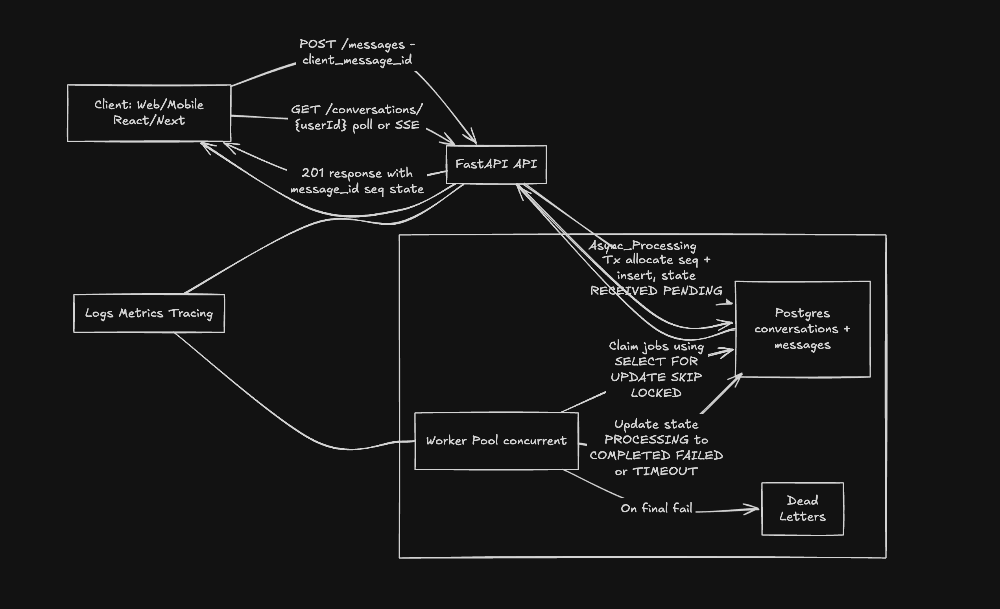

# AILA Messaging Backend (take-home)

Implements the backend requirements from the assignment:
- `POST /messages` creates a message immediately in **PENDING/RECEIVED** state
- background worker processes messages asynchronously with random delay + failures
- replies are always attached to the correct message and **conversation ordering is by send order (seq)**

## Design (high level)

- **Strict send order**: each conversation keeps a monotonic `seq` counter, allocated under a DB row lock.
- **Idempotency**: client provides `client_message_id` (UUID recommended). A unique DB constraint prevents duplicates.
- **Single in-flight processing**: workers claim jobs using Postgres `FOR UPDATE SKIP LOCKED`.
- **Durable intermediate storage**: message is committed to Postgres before any async work is started.
- **State machine**: `RECEIVED -> PROCESSING -> COMPLETED | FAILED | TIMEOUT` (with retries/backoff).



## Run

Requirements: Docker + Docker Compose.

```bash
docker compose up --build
```

API: http://localhost:8000 (OpenAPI docs at `/docs`)

## Sample API calls

Create 3 messages quickly (same user + conversation):

```bash
curl -s -X POST http://localhost:8000/messages \
  -H 'Content-Type: application/json' \
  -d '{"user_id":"u1","conversation_id":"c1","text":"Hi","client_message_id":"11111111-1111-1111-1111-111111111111"}' | jq

curl -s -X POST http://localhost:8000/messages \
  -H 'Content-Type: application/json' \
  -d '{"user_id":"u1","conversation_id":"c1","text":"What is tax deduction?","client_message_id":"22222222-2222-2222-2222-222222222222"}' | jq

curl -s -X POST http://localhost:8000/messages \
  -H 'Content-Type: application/json' \
  -d '{"user_id":"u1","conversation_id":"c1","text":"Give an example also","client_message_id":"33333333-3333-3333-3333-333333333333"}' | jq
```

Fetch conversation state (messages are ordered by `seq`, not completion time):

```bash
curl -s "http://localhost:8000/conversations/u1?conversation_id=c1" | jq
```

Poll a single message status:

```bash
curl -s "http://localhost:8000/messages/<message_id>/status" | jq
```

## Notes / knobs

Worker env vars (in `docker-compose.yml`):
- `MIN_DELAY_SECONDS`, `MAX_DELAY_SECONDS`
- `FAIL_RATE` (default 0.2)
- `CONCURRENCY`
- `MAX_ATTEMPTS`

## Production hardening (what we’d add next)

- SSE/WebSocket updates to push status changes (reduce polling).
- Alembic migrations.
- Per-user rate limiting + quotas.
- Cancellation endpoint (best-effort cancel by state/lease).
- Metrics: queue depth, processing latency percentiles, failure rate, retries, DLQ count.
